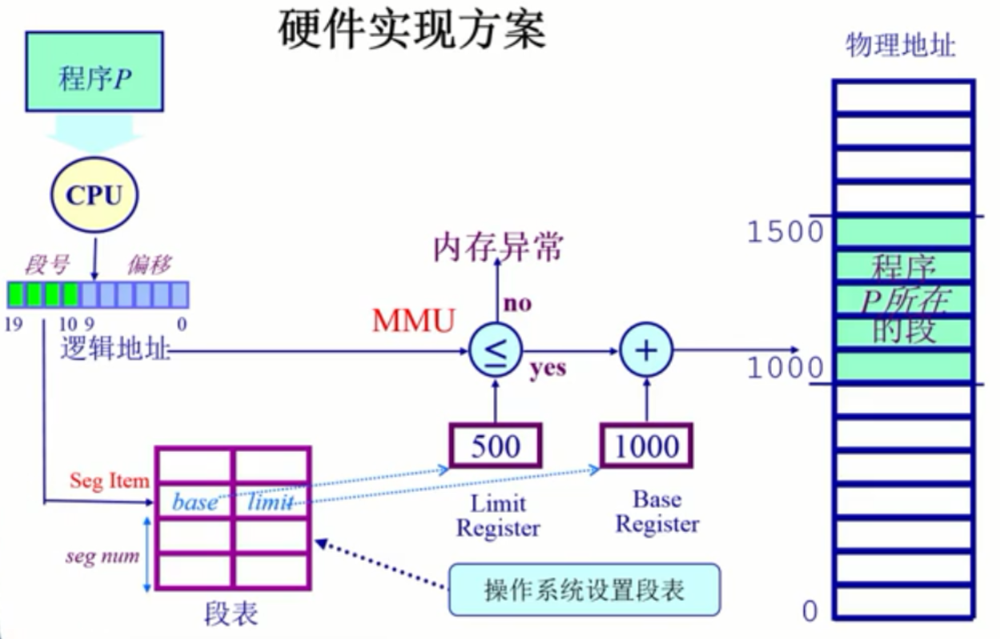
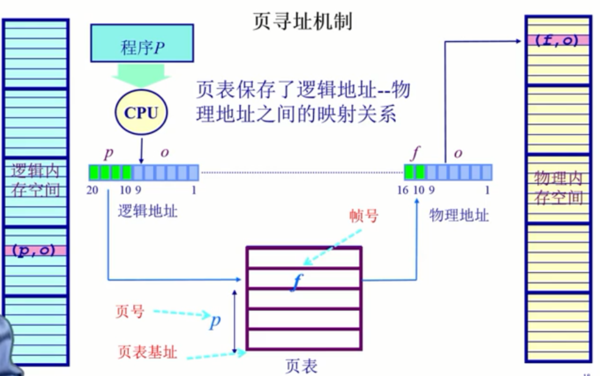

# 启动
DISK: 存放OS和BootLoader；  
BIOS： 基本I/O处理系统;  

**BIOS**:计算机加电之后BIOS将进行自检（POST），然后将BootLoader从硬盘中加载到内存中，BootLoader掌握CPU控制权。    
**BootLoader**： 将操作系统的代码和数据从硬盘加载到内存中，跳到操作系统的起始地址，将控制权交给操作系统。  

## 中断、异常、系统调用
**系统调用**（来源应用程序）：应用程序主动向操作系统发出服务请求。  
**异常**（来源于不良的应用程序）：非法指令或者其他坏的处理状态。  
**中断**（来源于外设）：来自不同状态的计时器和网络中断。  
操作系统利用这三者与外设和应用程序打交道。用中断和I/O来处理外设，用系统调用和异常为应用程序提供服务和支持。三者区别：  
1.来源：系统调用来源于应用程序请求操作系统提供服务，异常来源于应用程序意想不到的行为，中断来源于外设。   
2.处理时间：中断是异步的，异常是同步的，系统调用是同步或异步的。   
3.响应状态：中断是持续的，对用户应用程序是透明的；异常会杀死或重新执行意想不到的应用程序指令；系统调用则是等待服务完成之后就继续执行。

为什么应用程序不能直接访问外设而要通过操作系统？  
1.在计算机运行中，内核是被信任的第三方；  
2.只有内核可以执行特权指令；  
3.为了方便应用程序。  
    
#### 中断的处理过程：    
分为硬件的处理过程和软件的处理过程。对应不同编号的中断的服务例程有不同的地址。操作系统收到中断之后，就会查找中断表，找到对应的服务例程的起始地址，转跳到那里开始执行。    
硬件：设置中断标记。1.将内部、外部事件这只中断标记；2.中断事件的ID。    
软件，即操作系统：1.保存当前状态；2.中断服务处理程序；3.中断完成后清除中断标记；4.恢复之前保存的处理状态。    
   
#### 异常的处理过程：    
异常也有异常编号。产生异常时，操作系统先保存现场，再根据异常编号进行相应的处理（杀死产生了异常的程序后者重新执行异常指令），最后恢复现场。    
#### 系统调用    
例子：标准C语言库中，应用程序调用printf()时，会触发系统调用write()，write系统调用会带一些参数，指定显示字符串的设备以及字符串的内容。操作系统在获取参数之后会直接访问对应的设备，让对应的设备将字符串显示出来。这整个过程由操作系统而非应用程序完成，应用程序只需要发出请求。操作系统完成处理之后就会返回一个成功或者失败，应用程序可以继续之后的工作。   
应用程序访问系统调主要是通过高层次的API接口，而不是直接进行系统调用。    
系统调用在执行时间上的开销超过程序调用，但是它更加安全。   
    
# 内存
操作系统如何管理物理内存？    
计算机体系结构主要包括CPU、内存和I/O外设三个部分。    
内存的层次结构：  

微处理器（CPU寄存器=>一级缓存=>二级缓存）     
           ||  
           ||  
          主存   
           ||    
           ||（交换/分页）    
     磁盘（虚拟内存）   
    
从上到下容量越来越大，速度越来越慢。     
   
为了管理内存，操作系统需要完成四项工作：    
* 抽象：逻辑地址空间；    
* 保护：独立地址空间；   
* 共享：访问相同内存；    
* 虚拟化：更多的地址空间。 

在操作系统中管理内存的不同方法：    
* 程序重定位   
* 分段   
* 分页
* 虚拟内存   
* 按需分页虚拟内存    

### 地址空间及地址生成    
**地址空间**   
* 物理地址空间：硬件直接对应的地址空间；
* 逻辑地址空间：一个运行的程序所拥有的内存范围。   
   
两者之间如何建立对应关系？     
逻辑地址空间最终是落在物理地址空间上的。    
操作系统建立逻辑地址到物理地址之间的映射。   
   
操作系统还要保证应用程序访问的内存地址是合法的。实际上是一个地址的安全检测的过程。    

## 内存分配
**连续内存分配**     
* 内存碎片问题    
内存碎片是指不能被使用的空闲内存。分为外部碎片（在分配单元间的未使用内存）和内部碎片（在分配单元中的未使用内存）。

分区的动态分配策略：   
* 首次适配：为了分配n字节，使用第一个比n大的可用空闲块。
* 最优适配：为了分配n字节，使用比n大的最小可用空间。
* 最差适配：为了分配n字节，使用比n大的最大可用空间。    

**压缩式与变换式碎片整理**    
压缩式：将碎片挪到一起；    
变换式：将空闲块移动到虚拟内存（磁盘）。    

**非连续内存分配**
优点：一个程序的物理内存可以是非连续的；更好的内存利用和管理；允许共享代码和数据；支持动态加载和动态链接。
      
主要有两种方法：分段和分页。      
      
**分段**       
    
   
   
一个段就是一个内存块。程序访问内存地址需要一个二维的二元组，包括：s-段号，addr-段内偏移。    
    
   
      
**分页**     

分段寻址需要知道段号和段内偏移，分页也需要知道页号和页内偏移。主要区别在于：段的大小是可变的，而页的大小是固定不变的。分段用的比较少，主要采用分页的机制进行内存分配。   
分页机制将物理内存划分为固定大小的帧，大小是2的幂。同时将逻辑地址空间划分为大小相同的页。页是指逻辑页，页帧指物理页。     
物理内存被分割为大小相等的帧，一个内存物理地址是一个二元组，由帧号f和帧内偏移o两部分组成。   
逻辑地址空间也被分为大小相等的页，由页号p和页内偏移o组成。    
逻辑地址和物理地址的对应关系为：      
 
    
# 虚拟内存
老技术
* 覆盖技术：为了在较小的内存中运行较大的程序。原理是把程序按照其自身的逻辑结构，划分为若干个功能上相对独立的程序模块，那些不会同时执行的模块共享同一块内存区域，按时间先后顺序来运行。增加了程序员的负担。    
* 交换技术：多道程序在内存中时，让正在运行的程序或需要运行的程序获得更多的内存资源。方法1.将暂时不能运行的程序送到内存外，从而获得空闲的内存空间；2.操作系统将一个进程的整个地址空间内容保存到外存中，从而将外存中的某个进程的地址空间读入到内存中。换入换出内容的大小为整个程序的地址空间。增加了处理器的开销。        

**虚拟内存管理技术**    
目标：
* 像覆盖技术一样，不是把程序的所有内容都放在内存中，因而能够运行比当前空闲内存还要大的程序。但要做得更好，由操作系统自己完成，无需程序员干涉；   
* 像交换技术那样，能够实现进程在内存与外存之间的交换，因而获得更多的空闲内存空间。但要做得更好，只对进程的部分内容在内存和外存之间进行交换。    

程序的局部性原理：指程序在执行过程中的一个较短时期，所执行的指令地址和指令的操作数地址分别局限于一定区域。这可以表现为：
1. 时间局部性：一条指令的一次和下一次执行、一个数据的访问和下一次访问都集中在一个较短的时期内；    
2. 空间局部性：当前指令和邻近的几条指令、当前访问的数据和邻近的几个数据都几种在一个较小的区域内。    

如果程序具备这两个局部性，则说明它的局部性很好，执行效率也相应很高。    

实现    
可以在页式或段式内存管理的基础上实现：
* 在装入程序时，不必将其全部装入到内存，而只需将当前需要执行的部分页面或段装入内存，就可以让程序开始执行；    
* 在程序执行过程中，如果需要执行的指令或访问的数据尚未在内存中（称为缺段或缺页），则由处理器通知操作系统将相应的页面或段调入到内存，然后继续执行程序；    
* 另一方面，操作系统将内存中暂时不用的页面或段调出保存在外存上，从而腾出更多空闲空间存放将要装入的程序以及将要调入的页面或段。     

特征：   
* 大的用户空间
* 只需要进行部分交换
* 物理内存分配不连续，虚拟地址空间的使用也不连续。
     
# 进程
定义：一个具有一定独立功能的程序在一个数据集合上的一次动态执行过程。    
一个进程应该包括：   
* 程序的代码
* 程序处理的数据
* 程序计数器中的值，指示下一条将要执行的指令
* 一组通用的寄存器的当前值，堆、栈
* 一组系统资源（如打开的文件）

总之，进程包含了正在运行的一个程序的所有信息。   
    
程序与进程的关系：
* 程序是产生进程的基础。
* 程序的每次运行构成不同的进程。
* 进程是程序功能的体现。
* 通过多次执行，一个程序可以对应多个进程；通过调用关系，一个进程可以包括多个程序。 

程序与进程的区别：  
* 进程是动态的，程序是静止的：程序是有序代码的集合，进程是程序的执行，进程有核心态/用户态。
* 进程是暂时的，程序是永久的：进程是一个状态变化的过程，程序可以长久保存。   
* 进程和程序的组成不同：进程组成包括程序、数据和进程控制块（即进程状态信息）。

进程的特点：
* 动态性：可以动态的创建、结束进程；
* 并发性：进程可以被独立调度并占用处理机运行。并发是指在一个较短的时间段内执行多个进程，给人造成一种同时执行的错觉；并行是指在同一时刻执行多个进程。单核CPU是无法并行的；
* 独立性：不同进程的工作互不影响；
* 制约性：因访问共享数据/资源或进程间同步而产生的相互制约。  

进程控制块（PCB）：是描述进程的数据结构。每一个进程都有一个进程控制块，由操作系统进行管理。     
   
进程的生命周期：进程创建，进程运行，进程等待，进程唤醒，进程结束。    
   
引起进程创建的三个主要事件：
* 系统初始化时
* 用户请求创建一个新的进程
* 正在运行的进程执行了创建进程的系统调用

进程运行：内核选择一个就绪的进程，让它占用处理机并运行。  


进程等待（阻塞）的情况：
* 请求并等待无法马上完成的系统服务；
* 启动某种无法马上完成的操作；
* 需要的数据没有到达。
    
进程只能由自己阻塞。    
   
进程唤醒：
* 被阻塞进程需要的资源可被满足；
* 被阻塞进程等待的事件到达；
* 将该进程的PCB茶道就绪队列。

进程只能被别的进程或操作系统唤醒。    
    
进程退出：
* 正常退出（自愿的）
* 错误退出（自愿的）
* 致命错误（强制性的）
* 被其他进程杀死（强制性的）

进程的变化模型：运行态、就绪态、阻塞态三个状态之间的转换。       
   
进程的挂起：进程在挂起状态时，意味着进程没有占用内存空间。处在挂起状态的进程映像在磁盘上。    
挂起的状态：
* 阻塞挂起状态：进程在外存并等待某事件的出现
* 就绪挂起状态：进程在外存，但只要进入内存，即可运行。   

与挂起相关的状态转换：
* 阻塞到阻塞挂起：没有进程处于就绪状态或就绪进程要求更多内存资源时，会进入这种转换，以提交新进程或运行就绪进程；
* 就绪到就绪挂起：当有高优先级阻塞（系统任务会很快就绪的）进程和低优先级就绪进程时，系统会选择挂起低优先级进程；
* 运行到就绪挂起：对抢先式分时系统，当有高优先级阻塞挂起进程因事件出现而进入就绪挂起时，系统可能会把运行进程转到就绪挂起状态。
* 阻塞挂起到就绪挂起：当有阻塞挂起进程因相关事件出现时，系统会把阻塞挂起进程转换为就绪挂起的进程。该过程在外存中进行。
解挂/激活：将一个进程从外存转到内存，可能有以下两种情况：
* 就绪挂起到就绪：没有就绪进程或挂起就绪进程优先级高于就绪进程时，会进行这种转换
* 阻塞挂起到阻塞：当一个进程释放足够内存时，系统会把一个高优先级阻塞挂起（系统认为会很快出现所等待的事情）进程转换为阻塞进程。
     
进程通过状态队列来进行管理：
* 由操作系统来维护一组队列，用来表示系 统中所有进程的当前状态
* 不同状态分别用不同队列表示（就绪队列、各种不同类型的阻塞队列）
* 每个进程的PCB都根据它的状态加入到不同队列中，当一个进程的状态发生变化时，它的PCB从一个状态队列中脱离出来，加入到另外一个队列。   

## 线程    
目标：1.实体之间可以并发的执行；2.实体之间共享相同的地址空间。    
线程：进程中的一条执行流程。    
**从两个方面来重新理解进程**：
1. 从资源组合的角度：进程把一组相关的资源组合起来，构成了一个资源平台（环境），包括地址空间（代码段、数据段）、打开的文件等各种资源。   
2. 从运行的角度：代码在这个资源平台上的一条执行流程（线程）。    
线程控制块：TCB。
线程的优点：
* 一个进程中可以同时存在多个线程；
* 各个线程之间可以并发的执行；
* 各个线程之间可以共享地址空间和文件资源。   

缺点：一个线程崩溃，会导致其所属进程的所有线程崩溃。   
    
**进程与线程的比较**：
* 进程是资源分配的单位，线程是CPU调度的单位；
* 进程拥有一个完整的资源平台，而线程只独享必不可少的资源，如寄存器和栈；
* 线程同样具有就绪、阻塞和执行三种状态，同样具有状态间的转换关系；
* 线程能减少并发执行的时间和开销：    
      --线程的创建时间比进程短；    
      --线程的终止时间比进程短；
      --同一进程内的线程切换时间比进程短，进程切换需要切换页表，线程切换不需要；
      --由于同一线程的进程共享内存和文件资源，可直接进行不通过内核的通信。    
    
**线程的实现**：  
主要有三种实现方式：
1. 用户线程：在用户空间实现，是操作系统看不到的线程，由用户线程库来进行管理。
2. 内核线程：在内核中实现，是由操作系统管理的线程。
3. 轻量级线程：在内核中实现，支持用户线程。    
   
用户线程和内核线程的对应关系：多对一，一对一，多对多。   
    
### 用户线程
在用户空间实现的线程机制，它不依赖于操作系统的内核，由一组用户级的线程函数库来完成线程管理，包括线程的终止、创建、同步和调度等。     
由于用户线程的维护由相应的进程来完成，不需要操作系统内核来了解用户线程的存在，可用于不支持线程技术的多进程操作系统；   
每个进程都有它自己私有的线程控制块列表，用来跟踪记录它的各个线程的状态信息，TCB由线程函数库来维护；   
用户线程切换也是由线程函数库来完成，无需用户/核心态切换，所以速度特别快；   
允许每个进程拥有自定义的线程调度算法。   
 
用户线程的缺点：    
* 如果一个线程发起系统调用而阻塞，则整个进程在等待。因为操作系统并不知道用户线程的存在，在它看来就是一个进程，所以一阻塞整个进程都阻塞。
* 当一个线程开始运行后，除非它主动交出CPU的使用权，否则它所在的进程当中的其他线程将无法执行。   
* 由于时间片分配给进程，故与其他进程比，在执行多线程时，每个线程得到的时间片比较少，执行比较慢。    
     
### 内核线程
是指在操作系统的内核当中实现的一种线程机制，由操作系统的内核来完成线程的创建、终止和管理。    
在支持内核线程的操作系统中，由内核来维护进程和线程的上下文信息（PCB和TCB）；     
线程的创建、终止和切换都是通过系统调用/内核函数方式来进行，由内核来完成，因此系统开销比较大；   
在一个进程中，如果某个内核线程发起系统调用而被阻塞，并不会影响其他内核线程的运行；    
时间片分配给线程，多线程的进程获得更多的CPU时间。    
    
### 轻量级用户进程：
它是内核支持的用户线程。一个进程可以有一个或多个轻量级进程，每个轻量级进程由一个单独的内核线程来支持。    
     
# 上下文切换   
停止当前运行进程（从运行状态改变成其它状态）并且调度其他进程（转变成运行状态）。进程上下文切换主要是切换进程所使用到的寄存器和CPU状态等。     
可能进行上下文切换的进程队列有：就绪队列，等待I/O队列（每个设备的队列），僵尸队列。    
    
# CPU调度
**上下文切换**   ：
* 切换CPU当前任务，从一个进程/线程切换到另一个；
* 保存当前进程/线程在PCB/TCB中的执行上下文（CPU状态）；
* 读取一个进程/线程的上下文。    

**CPU调度**：
* 从就绪队列中挑选一个进程/线程作为CPU将要运行的下一个进程/线程；
* 调度程序：挑选进程/线程的内核函数（通过一些调度策略）
* 什么时候进行调度？从一个状态变换到另一个状态时。   

内核运行调度程序的条件（满足其中一个即可）：
1. 一个进程由运行状态切换到了等待状态；
2. 一个进程被终结了。   
    
**不可抢占**：调度程序必须等待事件结束。也就是说必须等待前一个进程完成之后才能开始下一个进程。    
**可以抢占**：1.调度程序在中断响应后执行；2.当前的进程从运行切换到就绪，或者一个进程从等待切换到就绪；3.当前运行的进程可以被换出。    
    
**调度算法的评价指标**：
* CPU使用率：CPU处于忙状态所占时间比
* 吞吐量：在单位时间内完成的进程数量
* 周转时间：一个进程从初始化到结束，包括所有等待时间所花费的时间
* 等待时间：进程在就绪队列中的总时间
* 响应时间：从一个请求被提交到产生第一次响应所花费的总时间   

吞吐量是操作系统的计算带宽，而响应时间是操作系统的计算延迟。低延迟调度增加了交互式表现，而操作系统需要保证吞吐量不受影响。通常两者不能同时满足，需要进行一定取舍。    
    
## 调度算法
* 先来先服务
* 短进程优先（短作业优先）短剩余时间优先：分为抢占式和非抢占式。平均等待时间最小。可能会导致长作业无限期等待。
* 最高响应比优先：不可抢占；考虑了进程等待时间，防止无限期推迟。
* 轮询：让各个进程按时间片轮流占用CPU。时间片太小会导致上下文切换频繁，时间片太大会变成先来先服务算法。
* 多级反馈队列：进程分成多个队列，不同队列采取不同算法。一个进程可以在不同队列中移动。
* 公平共享调度：在用户级别而不是进程级别进行调度。

**实时调度**    
    
**多处理器调度与优先级反转**   
优先级反转：可以发生在任何基于优先级和可抢占的调度机制中。当系统内部环境强制高优先级任务等待低优先级任务时发生。    
     
# 进程同步
**独立的线程**：
* 不和其他线程共享资源或状态
* 确定性=>输入状态决定结果
* 可重现=>能够重现起始条件，I/O
* 调度顺序不重要   

**合作线程**：
* 在多个线程中共享状态
* 不确定性
* 不可重现

不确定性和不可重现意味着bug可能是间歇性发生的。   
    
合作的优势：共享资源，加速，模块化    
    
**竞态条件**：计算的正确性取决于多个线程的交替执行时序时，就会发生竞态条件。避免竞态条件的方法就是不让操作被打断。    
**原子操作**：是指一次不存在任何中断或者操作的执行。该执行要么成功结束，要么根本没有执行，不存在任何只执行了一部分的状态。    
实际上的操作往往不是原子性的。      
    
**临界区**：是指进程中的一段需要访问共享资源，并且当另一个进程处于相应代码区域时就不会被执行的代码。    
**互斥**：当一个进程处于临界区并访问共享资源时，没有其他进程处于临界区并访问任何相同的资源。    
**死锁**：两个或两个以上的进程，在相互等待完成特定的任务，而最终没法将最终任务执行下去。

**锁**：在门上加上保护性装置，是的外人无法访问内部的东西，只有等到解锁之后才能访问。   
**解锁**：打开保护性装置，是的可以访问之前被保护的东西。    
**死锁**：A拿到锁1，B拿到锁2，A想拿到锁2后再继续执行，B想拿到锁1后再继续执行，导致A和B都无法继续执行。  

**临界区的属性**：
* 互斥：同一时间临界区最多只存在一个线程   
* Progress：如果一个线程想要进入临界区，那么他最终会成功。也就是说它不会无限制的等待   
* 有限等待：如果一个线程i处于入口区，那么在i的请求被接收之前，其他线程进入临界区的时间是有限制的   
* 无忙等待（可选）：如果一个进程在等待进入临界区，那么在它可以进入之前会被挂起     

**临界区的实现方式**：    
* 基于硬件中断：禁用中断。没有中断，没有上下文交换，所以没有并发。进入临界区时禁用中断，离开临界区时开启中断。单CPU、临界区较小时可用。
* 基于软件的解决方法。线程可以共享一些共有的变量来同步它们的行为。 
* 基于更高级的抽象，使用锁、信号量或者硬件原语来编写临界区。

对于第二种方法，首先是使用共享变量：   
```
int turn = 0;   
turn == i //表示谁该进入临界区   
Thread Ti   
      do {   
            while(turn != i);   
            critical section   
            turn = j;//交换使用权   
            reminder section   
      } while(1);   
```
这种方法满足互斥，但是有时不满足progress。Ti做其他事情时，Tj想要继续运行，但是必须要等待Ti处理临界区。    
    
第二种共享变量方法是使用一个数组来表示进程是否愿意进入临界区：   
```
int flag[2]; flag[0] = flag[1] = 0;   
flag[i] == 1 //表示进程是否准备好进入临界区   
Thread Ti   
      do {   
            while(flag[j] == 1);
                  flag[i] = 1;   
            critical section   
            flag[i] = 0;//交换使用权   
            reminder section   
      } while(1);   
```
不满足互斥性。   
    
第三种情况：
```
int flag[2]; flag[0] = flag[1] = 0;   
flag[i] == 1 //表示进程是否准备好进入临界区   
Thread Ti   
      do {   
            flag[i] = 1;  
            while(flag[j] == 1);     
            critical section   
            flag[i] = 0;//交换使用权   
            reminder section   
      } while(1);   
```
满足互斥，但存在死锁。某一时刻进程0进入while循环，flag[0]被赋值为1，然后切换到进程1，flag[1]被赋值为1，然后再切换到进程0。这时两个进程都会卡在while循环里面，形成死锁。   
   
一种正确的解决方法：使用两个共享数据项。
```
int turn; //指示谁该进入临界区
boolean flag[]; //指示进程是否准备好进入临界区
code for ENTER_CRITICAL_SECTION
      flag[i] = true;
      turn = j;
      while (flag[j] && turn == j);//j想进入临界区，而且也轮到它进入临界区，则进程i进入循环等待；直到有一个条件不符合时，i跳出循环，进入临界区
code for EXIT_CRITICAL_SECTION
      flag[i] = false;
```
具体代码为：
```
Thread Ti   
      do {   
            flag[i] = true;  
            turn = j;
            while(flag[j] == && turn == j);     
                  critical section   
            flag[i] = false;//交换使用权   
                  reminder section   
      } while(1);   
```
    
# 信号量和管程
**信号量**：是一个整型（sem），有两个原子操作
* P():sem减1，如果sem<0，等待，否则继续  
* V():sem加1，如果sem<=0，执行为操作的进程唤醒挂在信号量上等待的P   
      
**信号量的特征**：
* 信号量是整数
* 信号量是被保护的变量。初始化完成后，唯一能改变信号量的办法是通过P()和V()；操作必须是原子的
* P()能够被阻塞（信号量小于0时），而V()不能
* 我们假定信号量是公平的。一般先来的先被唤醒，实践中通常使用FIFO     
     
**两种信号量**：二进制信号量（可以是0或1，即互斥量），一般/计数信号量（可以取任意非负值）    
信号量可以用在两个方面：互斥和条件同步（调度约束--一个线程等待另一个线程的事情发生）。    
    
**用二进制信号量实现的互斥、同步**。对于复杂的问题，需要使用条件信号量来实现。
       
生产消费者问题：  
* 任一时刻只能有一个线程操作缓冲区（互斥性）；
* 当缓冲区为空，消费者必须等待生产者（调度/同步约束）；
* 当缓冲区慢，生产者必须等待消费者（调度/同步约束）。     
每个约束用一个单独的信号量：   
* 二进制信号量互斥；
* 一般信号量fullBuffers；
* 一般信号量emptyBuffers。   

代码实现如下：    
```
Class BoundBuffer{
      mutex = new Semaphore(1);//该信号量确保互斥性
      fullBuffers = new Semaphore(0);
      emptyBuffers = new Semaphore(n);//n为缓存区可以容纳的数据块个数
}

//生产者类
BoundedBuffer::Deposit(c){
      emptyBuffers->P();
      mutex->P();
      add c to the buffer;
      mutex->V();
      fullBuffers->V();
}

//消费者类
BoundedBuffer::Remove(c){
      fullBuffers->P();
      mutex->P();
      remove c to the buffer;
      mutex->V();
      emptyBuffers->V();
}
```
     
**信号量的实现**：    
```
class Semaphore{
      int sem;//信号量
      WaitQueue q;//等待队列
}

//P操作
Semaphore::P(){
      sem--;
      if(sem < 0){
            Add this thread t to q;//将当前进程加入等待队列
            block(p);//当前进程休眠
      }
}

//V操作
Semaphore::V(){
      sem++;
      if(sem <= 0){
            Remove a thread t from q;//从等待队列中移除一个进程
            wakeup(t);//唤醒该进程
      }
}
```    
    
**信号量不能处理死锁问题**。    
    
## 管程   
什么是管程？    
* 一个锁：指定临界区    
* 0或多个条件变量：等待/通知信号量用于管理并发访问共享数据。     
      
1. lock     
* Lock::Acquire()-等待直到锁可用，然后抢占锁     
* Lock::Release()-释放锁，如果有等待者，则唤醒它     
     
2. Condition Variable      
* 允许等待状态进入临界区     
允许处于等待（睡眠）的线程进入临界区      
某个时刻原子释放锁进入睡眠     
* Wait() operation    
当某个线程执行时，由于条件不满足，它就会释放锁，并睡眠    
* Signal() operation    
当条件得到满足时，会唤醒对应的条件变量，让挂在这个条件变量上的线程继续执行     
      
实现：  
```
class Condition{
      int numWaiting = 0;
      WaitQueue q;
}

Condition::Wait(lock){
      numWaiting++;
      Add this thread t to q;//当前线程加入等待队列
      release(lock);//释放锁，当前线程睡眠之前要释放锁，以免造成死锁
      schedule();//当前线程睡眠，选择下一个线程去执行
      require(lock);
}

Condition::Signal(){
      if(numWaiting > 0){//如果当前有线程等待在这个条件变量上
            Remove a thread t from q;
            wakeup(t);
            numWaiting--;
      }
}
``` 
    
用管程解决生产者消费者问题：   
```
Class BoundBuffer{
      Lock = lock;
      int count;
      Condition notFull, notEmpty;
}

//生产者类
BoundedBuffer::Deposit(c){
      lock->Acquire();
      while(count == n)
            notFull.Wait(&lock);
      add c to the buffer;
      count++;
      notEmpty.signal();
      lock->Release();
}

//消费者类
BoundedBuffer::Remove(c){
      lock->Acquire();
      while(count == 0)
            notEmpty.Wait(&lock);
      remove c to the buffer;
      count--;
      notFull.signal();
      lock->Release();
}
```
     
# 死锁
死锁:是指两个或两个以上的进程在执行过程中,因争夺资源而造成的一种互相等待的现象,若无外力作用,它们都将无法推进下去。

**资源有向图**：有死锁时必有环，有环时不一定有死锁。        
      
以下四个条件同时出现时才可能出现死锁：
* 互斥：在一个时间段内只能有一个进程使用资源；    
* 持有并等待：进程至少持有一个资源，并且等待获取其他进程持有的额外资源；    
* 无抢占：一个资源只能在进程完成它的任务之后被进程自愿释放；    
* 循环等待：存在进程集合{P0,P1,...PN},P0等待P1的资源，P1等待P2的资源...PN-1等待PN的资源，PN等待P0的资源。    
    
死锁的处理办法：    
* 死锁预防    
* 死锁避免    
* 死锁检测    
* 死锁恢复
    
1. 确保系统永远不会进入死锁状态；   
2. 系统进入死锁状态，然后恢复；   
3. 忽略这个问题，假装系统从来没有发生过死锁。这个方法应用于大多数操作系统。
       
## 进程间通信（IPC）   
IPC有两种操作：send和receive。如果两个进程之间需要通信，那么他们之间要建立通信链路，然后通过send/receive交换消息。通信链路分为物理链路（如共享内存，硬件总线）和逻辑链路（如逻辑属性）。      
### 直接通信    
send(P, message)：发送消息到进程P    
receive(Q, message)：从进程Q接收消息   
通信链路的属性：   
* 自动建立链路    
* 一条链路对应一对通信进程    
* 每对进程之间只有一条链接存在    
* 链接可以是单向的，但通常是双向的   
   
### 间接通信   
1. 定向从消息队列接收消息：每个消息队列都有一个唯一的ID，只有他们共享了一个消息队列，进程间才能够通信。    
2. 通信链路的属性：    
* 只有进程共享一个共同的消息队列，才建立链路    
* 链接可以与许多进程相关联     
* 每对进程可以共享多个通信链路    
* 链接可以是单向或双向   
     
消息传递可以是阻塞或非阻塞的，阻塞被认为是同步的，非阻塞被认为是异步的。   
     
通信方式：**信号**，**管道**，**消息队列**，**共享内存**（直接通信），Socket。
    
### 信号   
是一种软件中断，用于通知事件处理。   
接收到信号时如何处理？   
1. Catch：调用指定的信号处理函数   
2. Ignore：忽略信号，执行操作系统的默认操作，该信号不起作用   
3. Mask：闭塞信号，因此不会传送    
    
信号的不足之处是它不能传输要交换的任何数据。     
    
http://www.cnblogs.com/CheeseZH/p/5264465.html     
      
# 文件系统   
**文件系统**：一种用于持久性存储的系统抽象。    
**文件**：文件系统中一个单元的相关数据在操作系统中的抽象。    
文件系统的功能：   
1. 分配文件磁盘空间    
* 管理文件块（哪一块属于哪个文件）    
* 管理空闲空间（哪一块是空闲的）   
* 分配算法（策略）    
2. 管理文件集合    
* 定位文件及其内容    
* 命名：通过名字找到文件的接口    
* 分层文件系统   
* 文件系统类型（组织文件的不同方式）   
3. 提供的便利及特性    
* 保护： 分层来保护数据安全    
* 可靠性/持久性    
    
文件描述符：操作系统为每个进程维护一个打开文件的列表，文件描述符就是这个表中的一个索引。     
       
管理打开的文件需要的元数据：   
* 文件指针：指向最后一次读写的位置，每个打开了这个文件的进程都有这个指针；   
* 文件打开计数：记录有多少个进程打开了这个文件，即文件打开的次数。当最后一个进程关闭了文件时，才允许将其从打开文件的列表中移除；    
* 文件磁盘位置：文件在磁盘中的位置；   
* 访问权限：程序是否有权限读写文件。    
    
块是逻辑转换单元，而扇区是物理转换单元。     
在文件系统中的所有操作都是在整个空间块上执行的。    
    
访问模式：   
* 顺序访问：按字节依次读取，几乎所有访问都是这种方式。   
* 随机访问：不常用。    
* 基于内容的访问：如数据库是建立在索引内容的磁盘访问上的。

文件别名：两个或多个文件名关联同一个文件，即一个文件有多个名字。     
* 硬链接：多个文件项指向同一个文件   
* 软链接：以快捷方式指向其他文件    
* 通过存储真实文件的逻辑名称来实现   
   

文件别名可能会使文件路径形成循环，解决方法：   
* 只允许到文件的链接，不允许到子目录的链接   
* 每增加一个新的链接都用循环检测算法确定其是否合理   
* 限制路径可遍历文件目录的数量   
   
文件系统的分类：   
* 磁盘文件系统：文件存储在数据存储设备上，如磁盘。FAT，NTFS，ext2/3，IS09660等    
* 数据库文件系统：文件根据其特征是可被寻址（识别）的，如WinFS    
* 日志文件系统：记录文件系统的修改/事件    
* 网络/分布式文件系统：如NFS，SMB，AFS，GFS    
* 特殊/虚拟文件系统

## 目录   
文件以目录的方式组织起来。目录是一类特殊的文件，每个目录都包含了一张表<name, pointer to file header>。   
    
目录的典型操作：搜索文件，创建文件，删除文件，枚举目录，重命名文件，在文件系统中遍历一个路径。   
操作系统应该只允许内核模式修改目录，以确保映射的完整性，应用程序能够读取目录。     
     
如何实现目录？    
* 文件名的线性列表，包含了指向数据块的指针：编程简单，执行耗时    
* Hash表：使用hash数据结构的线性表。
    
名字解析：是指将逻辑名字转换成物理资源（如文件）的过程。     
     
**挂载点**：一个文件需要先被挂载然后才能使用。未被挂载的文件系统挂载在挂载点上。    

## 虚拟文件系统    
目的：对所有不同文件系统的抽象。    
功能：为不同类型的文件系统提供相同的文件和文件系统接口；管理所有文件和文件系统相关联的数据结构；高效查询例程，遍历文件系统；与特定的文件系统模块进行交互。     
    
基本的文件系统包括以下几个部分：   
1. 卷控制块（Unix:superblock）：每个文件系统一个，包含文件系统的详细信息，包括块、块大小、空余块、计数/指针等；    
2. 文件控制块（Unix:inode或vnode）：每个文件一个，包含文件的详细信息，包括许可、拥有者、大小、数据库位置等；    
3. 目录节点（Lnix:dentry）：每个目录项（目录和文件）一个，将目录项数据结构及树型布局编码成树型数据结构，指向文件控制块、父节点、项目列表等。    

这几种数据结构会在需要时被加载进内存：     
* 卷控制块：当文件系统挂载时进入内存    
* 文件控制块：当文件每次被访问时进入内存   
* 目录节点：在遍历一个文件路径时进入内存     
     


## 上下文切换详解
**上下文切换**（有时也称做进程切换或任务切换）是指 CPU 从一个进程或线程切换到另一个进程或线程。      
进程（有时候也称做任务）是指一个程序运行的实例。在 Linux 系统中，线程就是能并行运行并且与他们的父进程（创建他们的进程）共享同一地址空间（一段内存区域）和其他资源的轻量级的进程。      
上下文是指某一时间点 CPU 寄存器和程序计数器的内容。寄存器是 CPU 内部的数量较少但是速度很快的内存（与之对应的是 CPU 外部相对较慢的 RAM 主内存）。寄存器通过对常用值（通常是运算的中间值）的快速访问来提高计算机程序运行的速度。程序计数器是一个专用的寄存器，用于表明指令序列中 CPU 正在执行的位置，存的值为正在执行的指令的位置或者下一个将要被执行的指令的位置，具体依赖于特定的系统。      
稍微详细描述一下，上下文切换可以认为是内核（操作系统的核心）在 CPU 上对于进程（包括线程）进行以下的活动：（1）挂起一个进程，将这个进程在 CPU 中的状态（上下文）存储于内存中的某处，（2）在内存中检索下一个进程的上下文并将其在 CPU 的寄存器中恢复，（3）跳转到程序计数器所指向的位置（即跳转到进程被中断时的代码行），以恢复该进程。      
上下文切换有时被描述为内核挂起 CPU 当前执行的进程，然后继续执行之前挂起的众多进程中的某一个。尽管这么说对于澄清概念有所帮助，但是这句话本身可能有一点令人困惑。因为通过定义可以知道，进程是指一个程序运行的实例。所以说成挂起一个进程的运行可能更适合一些。      
### 上下文切换与模式切换
上下文切换只能发生在内核态中。内核态是 CPU 的一种有特权的模式，在这种模式下只有内核运行并且可以访问所有内存和其他系统资源。其他的程序，如应用程序，在最开始都是运行在用户态，但是他们能通过系统调用来运行部分内核的代码。系统调用在类 Unix 系统中是指活跃的进程（正在运行在 CPU 上的进程）对于内核所提供的服务的请求，例如输入/输出（I/O）和进程创建（创建一个新的进程）。I/O 可以被定义为任何信息流入或流出 CPU 与主内存（RAM）。也就是说，一台电脑的 CPU和内存与该电脑的用户（通过键盘或鼠标）、存储设备（硬盘或磁盘驱动）还有其他电脑的任何交流都是 I/O。
这两种模式（用户态和内核态）在类 Unix 系统中共存意味着当系统调用发生时 CPU 切换到内核态是必要的。这应该叫做模式切换而不是上下文切换，因为没有改变当前的进程。      
上下文切换在多任务操作系统中是一个必须的特性。多任务操作系统是指多个进程运行在一个 CPU 中互不打扰，看起来像同时运行一样。这个并行的错觉是由于上下文在高速的切换（每秒几十上百次）。当某一进程自愿放弃它的 CPU 时间或者系统分配的时间片用完时，就会发生上下文切换。      
上下文切换有时也因硬件中断而触发。硬件中断是指硬件设备（如键盘、鼠标、调试解调器、系统时钟）给内核发送的一个信号，该信号表示一个事件（如按键、鼠标移动、从网络连接接收到数据）发生了。      
英特尔的 80386 和更高级的 CPU 都支持硬件上下文切换。然而，大多数现代的操作系统通过软件实现上下文切换，而非使用硬件上下文切换，这样能够运行在任何 CPU 上。同时，使用软件上下文切换可以尝试获得更好的性能。软件的上下文切换最先在 Linux 2.4 中实现。      
软件上下文切换号称的一个主要优点是，硬件的机制保存了几乎所有 CPU 的状态，软件能够有选择性的保存需要被保存的部分并重新加载。然而这个行为对于提升上下文切换的性能到底有多重要，还有一点疑问。其拥护者还宣称，软件上下文切换有提高切换代码的可能性，它有助于提高正在加载的数据的有效性，从而进一步提高性能。      
### 上下文切换的消耗
上下文切换通常是计算密集型的。也就是说，它需要相当可观的处理器时间，在每秒几十上百次的切换中，每次切换都需要纳秒量级的时间。所以，上下文切换对系统来说意味着消耗大量的 CPU 时间，事实上，可能是操作系统中时间消耗最大的操作。      
Linux相比与其他操作系统（包括其他类 Unix 系统）有很多的优点，其中有一项就是，其上下文切换和模式切换的时间消耗非常少。      

