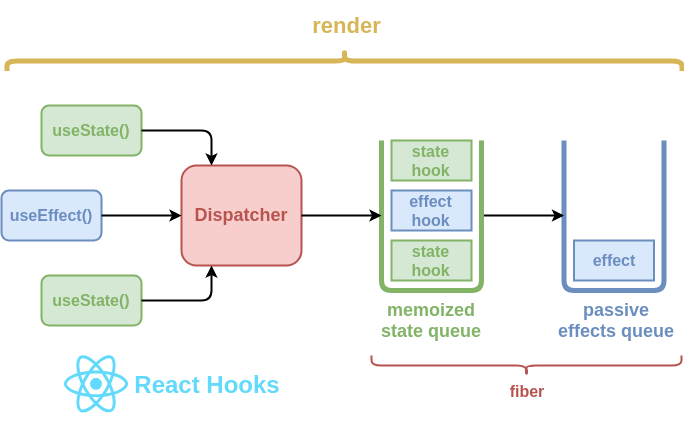

[原文链接](https://medium.com/the-guild/under-the-hood-of-reacts-hooks-system-eb59638c9dba)
     
首先看如何保证hooks在React的作用域下被调用，因为如果不在正确的作用域下被调用，hooks的存在就毫无意义。      
# The dispatcher     
dispatcher是一个共享对象，它包含了hook函数。根据不同的渲染阶段，他会被动态创建和清除，并且它保证用户不能在React组件外使用hooks（[源码](https://github.com/facebook/react/blob/5f06576f51ece88d846d01abd2ddd575827c6127/packages/react-reconciler/src/ReactFiberDispatcher.js#L24)）。       
在我们切换到正确的dispatcher来渲染root component之前，通过一个名为enableHooks的标记来启用/禁用hooks。这意味着从技术上讲我们可以在运行时启用/禁用钩子。React 16.6.X也有一些试验性的分支实现了这个功能，但是它实际上是禁用的（[源码](https://github.com/facebook/react/tree/5f06576f51ece88d846d01abd2ddd575827c6127/packages/react-reconciler/src/ReactFiberScheduler.js#L1211)）。        
当执行渲染的时候，我们禁用hooks，以免hooks在ReactDOM的渲染周期之外被意外的修改。这是避免用户随意修改hooks的机制（[源码](https://github.com/facebook/react/blob/5f06576f51ece88d846d01abd2ddd575827c6127/packages/react-reconciler/src/ReactFiberScheduler.js#L1376)）。      
在每次hook调用时，使用一个名为resolveDispatcher的函数来调用dispatcher。正如之前说过的，这在React渲染周期以外是没有意义的，React会打印提示信息“Hooks can only be called inside the body of a function component”（[源码](https://github.com/facebook/react/tree/5f06576f51ece88d846d01abd2ddd575827c6127/packages/react/src/ReactHooks.js#L17)）。     
```
let currentDispatcher
const dispatcherWithoutHooks = { /* ... */ }
const dispatcherWithHooks = { /* ... */ }

function resolveDispatcher() {
  if (currentDispatcher) return currentDispatcher
  throw Error("Hooks can't be called")
}

function useXXX(...args) {
  const dispatcher = resolveDispatcher()
  return dispatcher.useXXX(...args)
}

function renderRoot() {
  currentDispatcher = enableHooks ? dispatcherWithHooks : dispatcherWithoutHooks
  performWork()
  currentDispatcher = null
}
```
现在我们已经介绍了简单的封装机制，接下来进入这篇文章的核心部分--hooks。顺便介绍一个新概念。     
# The hooks queue     
在底层，hooks是按调用顺序链接起来的一些节点。之所以这样是因为hooks并不仅仅是被创建出来然后各自独立存在，他们有一套自己的机制。一个hook节点有以下这些属性：    
* 在初次渲染中被创建的初始state
* 可以被更改的state
* 在之后的渲染中React会记住hook的state
* React会根据调用的顺序提供给你正确的state
* React知道这个hook属于哪个fiber节点      
相应地，我们应该重新思考我们看待组件中state的方式。目前为止我们可能认为它是一个普通对象：     
```
{
  foo: 'foo',
  bar: 'bar',
  baz: 'baz',
}
```
但是和hooks一起工作时，它应该是一个队列，队列中的每个节点代表state的一个简单模型：
```
{
  memoizedState: 'foo',
  next: {
    memoizedState: 'bar',
    next: {
      memoizedState: 'bar',
      next: null
    }
  }
}
```
hook节点的具体实现见[源码](https://github.com/facebook/react/blob/5f06576f51ece88d846d01abd2ddd575827c6127/packages/react-reconciler/src/ReactFiberHooks.js#L243)。可以看到hook节点有几个附加属性，但是理解hook工作流程的关键在于memoizedState和next两个属性。其余的属性被useReducer用来缓存已经发布的action和基本状态，以备后续的重复使用：
* baseState - 被给到reducer的状态对象
* baseUpdate - 创建baseState的最新的一个action
* baseState - 被分发的action组成的队列，等待通过reducer
在每一个函数组件被调用之前，一个名为prepareHooks的函数会被调用，在这里当前的fiber和它的hooks链表中的第一个hook节点会被存储为全局变量。这样，每次调用一个hook函数（useXXX）我们能知道它的调用上下文。      
```
let currentlyRenderingFiber
let workInProgressQueue
let currentHook

// Source: https://github.com/facebook/react/tree/5f06576f51ece88d846d01abd2ddd575827c6127/react-reconciler/src/ReactFiberHooks.js:123
function prepareHooks(recentFiber) {
  currentlyRenderingFiber = workInProgressFiber
  currentHook = recentFiber.memoizedState
}

// Source: https://github.com/facebook/react/tree/5f06576f51ece88d846d01abd2ddd575827c6127/react-reconciler/src/ReactFiberHooks.js:148
function finishHooks() {
  currentlyRenderingFiber.memoizedState = workInProgressHook
  currentlyRenderingFiber = null
  workInProgressHook = null
  currentHook = null
}

// Source: https://github.com/facebook/react/tree/5f06576f51ece88d846d01abd2ddd575827c6127/react-reconciler/src/ReactFiberHooks.js:115
function resolveCurrentlyRenderingFiber() {
  if (currentlyRenderingFiber) return currentlyRenderingFiber
  throw Error("Hooks can't be called")
}
// Source: https://github.com/facebook/react/tree/5f06576f51ece88d846d01abd2ddd575827c6127/react-reconciler/src/ReactFiberHooks.js:267
function createWorkInProgressHook() {
  workInProgressHook = currentHook ? cloneHook(currentHook) : createNewHook()
  currentHook = currentHook.next
  workInProgressHook
}

function useXXX() {
  const fiber = resolveCurrentlyRenderingFiber()
  const hook = createWorkInProgressHook()
  // ...
}

function updateFunctionComponent(recentFiber, workInProgressFiber, Component, props) {
  prepareHooks(recentFiber, workInProgressFiber)
  Component(props)
  finishHooks()
}
```
一旦更新完成，一个名为finishHooks的函数会被调用，在这个函数中将hooks链表中的第一个节点赋值给当前节点的memoizedState属性。这意味着hooks链表和它们的state可以在外部被获取到。      
```
const ChildComponent = () => {
  useState('foo')
  useState('bar')
  useState('baz')

  return null
}

const ParentComponent = () => {
  const childFiberRef = useRef()

  useEffect(() => {
    let hookNode = childFiberRef.current.memoizedState

    assert(hookNode.memoizedState, 'foo')
    hookNode = hooksNode.next
    assert(hookNode.memoizedState, 'bar')
    hookNode = hooksNode.next
    assert(hookNode.memoizedState, 'baz')
  })

  return (
    <ChildComponent ref={childFiberRef} />
  )
}
```
接下来逐个看看每一个hooks。      
# State hooks
在底层，useState钩子调用了useReducer钩子，只是为它提供了预定义的reducer（[源码](https://github.com/facebook/react/blob/5f06576f51ece88d846d01abd2ddd575827c6127/packages/react-reconciler/src/ReactFiberHooks.js#L339)）。这意味着useState返回的结果实际上是一个reducer状态和一个dispatcher。看一眼state hook是如何调用reducer hook的：
```
function basicStateReducer(state, action) {
  return typeof action === 'function' ? action(state) : action;
}
```
因此，我们可以直接给action dispatcher提供新的state；我们也可以为dispatcher提供一个action函数，这个函数接受旧的state作为参数，返回一个新的state。这意味着如果你将state setter向下传递，你能在不传递新props的条件下改变父组件的state：   
```
const ParentComponent = () => {
  const [name, setName] = useState()
  
  return (
    <ChildComponent toUpperCase={setName} />
  )
}

const ChildComponent = (props) => {
  useEffect(() => {
    props.toUpperCase((state) => state.toUpperCase())
  }, [true])
  
  return null
}
```
# Effect hooks
Effect hooks的表现明显不同，他有一层额外的逻辑。有以下几点值得注意：    
* 他们在render时被创建，但是在painting之后才运行
* 他们会在下一次painting之前被销毁
* 他们按照定义的顺序被调用
有一个额外的链表用来保存这些effects，他们应该在painting之后被调用。通常来说，一个fiber节点有一个队列来保存这些effect节点。每个effect节点有不同的type，且在他们对应的阶段被调用：    
* 在更新之前调用getSnapshotBeforeUpdate的实例（[源码](https://github.com/facebook/react/blob/5f06576f51ece88d846d01abd2ddd575827c6127/packages/react-reconciler/src/ReactFiberScheduler.js#L646)）      
* 执行所有的插入、更新、删除和ref卸载（[源码](https://github.com/facebook/react/blob/5f06576f51ece88d846d01abd2ddd575827c6127/packages/react-reconciler/src/ReactFiberScheduler.js#L687)）     
* 执行所有的生命周期方法和ref回调[源码](https://github.com/facebook/react/tree/5f06576f51ece88d846d01abd2ddd575827c6127/packages/react-reconciler/src/ReactFiberScheduler.js#L732)）      
* 由useEffect产生的effects（[源码](https://github.com/facebook/react/blob/5f06576f51ece88d846d01abd2ddd575827c6127/packages/react-reconciler/src/ReactFiberScheduler.js#L779)）     
对于hook effects，他们应该被存在fiber节点的updateQueue属性上，每个effect节点有以下属性：    
* tag - 一个二进制数，代表effect的行为    
* create - painting之后应该被调用的回调    
* destroy - 在初始化render之前被运行的回调，是create的返回值    
* inputs - 一个值的集合，决定effect应该被销毁还是重建    
* next - 在函数组件中定义的下一个effect      
除了tag属性，其他属性很容易被理解。如果你对hook理解的很好，你应该知道React提供了两个特殊的钩子：useMutationEffect和useLayoutEffect。这两个钩子内部使用了useEffect，这实际上意味着他们创建了一个effect节点，但是他们使用了不同的tag值。   
tag由二进制的值组合而成（[源码](https://github.com/facebook/react/blob/5f06576f51ece88d846d01abd2ddd575827c6127/packages/react-reconciler/src/ReactHookEffectTags.js)）：   
```
const NoEffect = /*             */ 0b00000000;
const UnmountSnapshot = /*      */ 0b00000010;
const UnmountMutation = /*      */ 0b00000100;
const MountMutation = /*        */ 0b00001000;
const UnmountLayout = /*        */ 0b00010000;
const MountLayout = /*          */ 0b00100000;
const MountPassive = /*         */ 0b01000000;
const UnmountPassive = /*       */ 0b10000000;
```
对二进制值最常规的用法是使用|操作符将它作为单独的值添加到位上。然后我们可以用&操作符检查tag是否包含一个特定的操作，如果结果非0，表示这个tag代表了这个特定操作：
```
const effectTag = MountPassive | UnmountPassive
assert(effectTag, 0b11000000)
assert(effectTag & MountPassive, 0b10000000)
```
下面是React支持的effect类型及其tag：
* Default effect — UnmountPassive | MountPassive
* Mutation effect — UnmountSnapshot | MountMutation
* Layout effect — UnmountMutation | MountLayout
下面是React如何检查行为的（[源码](https://github.com/facebook/react/blob/5f06576f51ece88d846d01abd2ddd575827c6127/packages/react-reconciler/src/ReactFiberCommitWork.js#L309)）：
```
if ((effect.tag & unmountTag) !== NoHookEffect) {
  // Unmount
}
if ((effect.tag & mountTag) !== NoHookEffect) {
  // Mount
}
```
根据我们刚刚学到的关于hooks的知识，我们可以从外部将effect插入到特定的fiber中： 
```
function injectEffect(fiber) {
  const lastEffect = fiber.updateQueue.lastEffect

  const destroyEffect = () => {
    console.log('on destroy')
  }

  const createEffect = () => {
    console.log('on create')

    return destroy
  }

  const injectedEffect = {
    tag: 0b11000000,
    next: lastEffect.next,
    create: createEffect,
    destroy: destroyEffect,
    inputs: [createEffect],
  }

  lastEffect.next = injectedEffect
}

const ParentComponent = (
  <ChildComponent ref={injectEffect} />
)
```