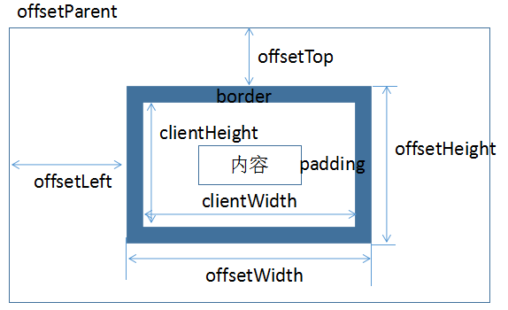
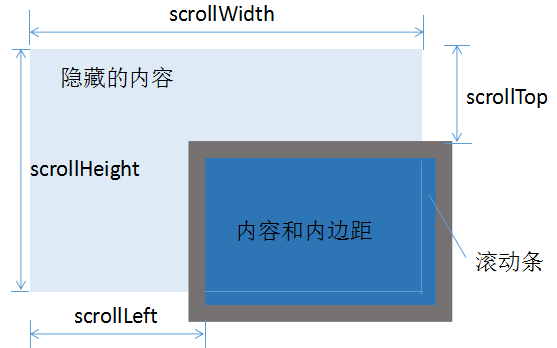

用typeof检测基本类型，用instanceof检测对象的类型。        
        
函数参数都是按值传递，其中引用类型的参数传递的是它在内存中的地址。        
        
**执行环境**定义了变量或函数有权访问的其他数据，决定了他们各自的行为。每个执行环境都有与之关联的**变量对象**，环境中定义的所有变量和函数都保存在这个变量对象上。             
全局执行环境是最外围的一个执行环境。在web浏览器中，全局执行环境被认为是window对象，因此所有全局变量和函数都是作为window对象的属性和方法而创建的。某个执行环境中所有代码被执行完毕后，该执行环境被销毁，保存在其中的变量和函数也被销毁。全局执行环境直到程序退出（如页面关闭）时才会被销毁。            
每个函数都会有自己的执行环境。当执行流程进入一个函数时，函数的环境就会被推入一个环境栈中。而函数执行之后，栈将其环境弹出，把控制权交还给之前的执行环境。    
当代码在一个环境中执行时，会创建变量对象的一个作用域链。作用域链的用途是保证对执行环境有权访问的所有变量和函数的有序访问。作用域链的最前端始终都是当前执行的代码所在环境的变量对象。如果这个环境是函数，则将其活动对象作为变量对象。活动对象在最开始时只包含一个对象，即arguments对象。     
垃圾收集：标记清除，引用计数。            

对象的属性分为**数据属性**和**访问器属性**两种。其中，对象属性有4个描述其行为的特性：[[Configurable]],[[Enumerable]], [[Writable]]和[[Value]];访问器属性也有四个：[[Configurable]],[[Enumerable]], [[Get]]和[[Set]]。用Object.getOwnPropertyDescriptor()方法可以获得给定属性的描述符。     
              
## 创建对象     
### 1. 工厂模式      
```
function createPeople(name, age){
    var obj = new Object();
    obj.name = name;
    obj.age = age;
    obj.sayName = function(){
        console.log(this.name);
    }
    return obj;
}
```    
缺陷：无法识别对象。
### 2. 构造函数模式        
```
function People(name, age){
    this.name = name;
    this.age = age;
    this.sayName = function(){
        console.log(this.name);
    }
}
```    
缺陷：每个方法都要在每个实例上重新创建一遍。
### 3. 原型模式        
```
function People(){

}   

People.prototype.name = name;
People.prototype.age = age;
People.prototype.sayName = function(){
    console.log(this.name);
}
```    
缺陷：1.省略为构造函数传参的环节，结果所有实例在默认情况下都有相同的默认值；2.一个实例对象改变属性，其他实例对象随之改变。
### 4. 组合使用构造函数模式和原型模式        
### 5. 动态原型继承     
```
function People(name, age){
    this.name = name;
    this.age = age;

    if(typeof this.sayName != 'function'){
        this.prototype.sayName = function(){
            console.log(this.name);
        }
    }
}
```     


## 继承
### 1. 基于原型的继承        
子类的原型指向父类的实例。     
```
function Super(){
    this.name = 'Liuyawin';
    this.friends = [];
}

Super.prototype = {
    constructor: Super,
    sayFriends: function(){
        console.log(this.friends);
    }
}

function Sub(){};

Sub.prototype = new Super();

//test
var sub1 = new Sub();
sub1.friends.push('Jim');

var sub2 = new Sub();
sub2.friends.push('Green');

sub1.sayFriends();//["Jim", "Green"]
```       
缺陷：1.不能传递参数，2.引用类型的属性一变都变，3.原型对象上的constructor属性错误         
### 2. 借用构造函数          
在子类型内部调用超类的构造函数。     
```     
function Super(){
    this.name = 'Liuyawin';
    this.friends = [];
}
Super.prototype = {
    constructor: Super,
    sayFriends: function(){
        console.log(this.friends);
    }
}

function Sub(){
    Super.call(this);
};

Sub.prototype = {
	constructor: Sub,
	sayName: function(){
		console.log(this.name);
	}
}
var sub = new Sub();
sub.sayName();
sub.sayFriends();//sub.sayFriends is not a function
```      
缺陷：1.子类方法都在构造函数中，做不到方法复用；2.超类原型中定义的方法对子类不可见。         
### 3. 组合继承      
```
function Super(name){
    this.name = name;
    this.friends = [];
}
Super.prototype = {
    constructor: Super,
    sayFriends: function(){
        console.log(this.friends);
    }
}

function Sub(name,age){
    Super.call(this, name);
    this.age = age;
};

Sub.prototype = new Super();
Sub.prototype.constructor = Sub;

Sub.prototype.sayName = function(){
    console.log(this.name);
}
```
最常用。缺点：会调用两次超类的构造函数，后果就是有两组属性，一组在Sub原型上，一组在实例对象上。     
### 4. 原型式继承      
```
function object(o){
    function F(){};
    F.prototype = o;

    return new F();
}
```    
缺陷：引用类型一变都变。       
### 5. 寄生式继承          
```
function object(o){
    var clone = Object(o);

    clone.sayName = function(){
        console.log(this.name);
    }

    return clone;
}
```
缺陷：方法在每个实例对象中都复制一份，不能复用。      
### 6. 寄生组合式继承     
```
function inheritPrototype(superType, subType){
    var prototype = Object(superType.prototype);
    prototype.constructor = subType;
    subType.prototype = prototype;
}

function Super(name){
    this.name = name;
    this.friends = [];
}
Super.prototype = {
    constructor: Super,
    sayFriends: function(){
        console.log(this.friends);
    }
}

function Sub(name,age){
    Super.call(this, name);
    this.age = age;
};

inheritPrototype(Super, Sub);//注意这里与组合继承的区别

Sub.prototype.sayName = function(){
    console.log(this.name);
}
```    
     
## 闭包
#### 1. 复习作用域链
当某个函数被调用时，会创建一个执行环境及相应的作用域链。然后使用arguments和其他命名参数来初始化函数的活动对象。在作用域链中，外部函数的活动对象始终处于第二位，外部函数的外部函数的活动对象处于第三位，......直至作用域链终点的全局执行环境。         
后台的每个执行环境都有一个表示变量的对象--变量对象。全局环境的变量对象始终存在，而函数的局部环境的变量对象则只在函数执行过程中存在。在创建函数时，会创建一个预先包含全局变量对象的作用域链，这个作用域链被保存在内部的[[Scope]]属性中。当调用函数时，会为函数创建一个执行环境，然后通过复制函数的[[Scope]]属性中的对象构建起执行环境的作用域链。此后，又有一个活动对象被创建并被推入执行环境作用域链的前端。作用域链的本质是一个指向变量对象的指针列表，它只引用但不实际包含对象。        
#### 2. 闭包      
```
function outter(){
    var count = 0;
    return function inner(){
        count++;
        console.log(count);
    }
} 
```     
上面的例子中，inner在从outter中返回后，其作用域链被初始化为包含outter函数的活动对象和全局的变量对象。这样，inner就可以访问outter中定义的所有变量。更为重要的是，outter函数执行完毕后，其变量对象不会被销毁，因为inner的作用域链仍然会引用这个对象。实际上，outter执行完毕后，它的执行环境的作用域链会被销毁，但它的活动对象仍然留在内存中，直到inner函数被销毁后，outter函数才会被销毁。         
注意：闭包保存的是整个变量对象，而不是某个特殊的变量。             
      
**获取页面视口大小**       
```
function getPageSize(){
    var pageWidth = window.innerWidth,
        pageHeight = window.innerHeight;

    if(typeof pageWidth !== 'number'){
        if(document.compatMode === 'CSS1Compat'){
            pageWidth = document.documentElement.clientWidth;
            pageHeight = document.documentElement.clientHeight;
        } else {
            pageWidth = document.body.clientWidth;
            pageHeight = document.body.clientHeight;
        }
    }

    return {
        pageWidth: pageWidth,
        pageHeight: pageHeight
    }
}
```           
       
## BOM           
使用setTimeout代替setInterval。因为setInterval的后一次调用可能会在前一次结束之前启动。         
            
alert，confirm，prompt            
            
### location对象
#### 8个属性
hash（片段），host（主机名带端口号），hostname（主机名不带端口号），href，pathname，port，protocol，search。      
#### 3个方法
assign()           
跳转并生成一条浏览记录。           
assign('https://www.baidu.com')完全等价于window.location.href = 'https://www.baidu.com'。
replace()           
跳转不生成浏览记录，回退按钮不能回退到上一个页面。           
reload()           
          
### screen对象        
### navigator对象            
### history对象          
          
### 偏移量     
             
              